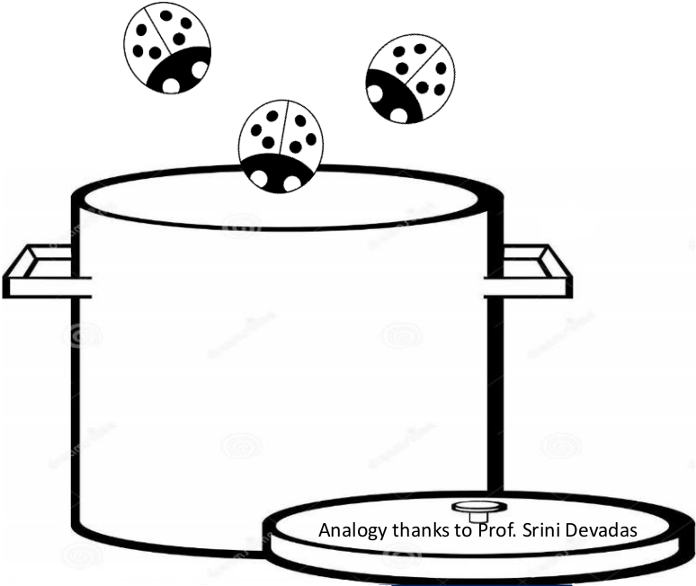

# Тестирование и отладка
## Написание программ, которые делают ровно то, что задумано - непростая задача

## Наша цель - написание качественных программ
Можно привести аналогию с супом: вы готовите суп в дачном домике, но с потолка в него падают жучки (ошибки). Что делать, чтобы суп оказался качественным?
* проверять, нет ли жучков в супе - тестирование
* держать крышку закрытой - защитное программирование (defensive programming)
* потравить жучков, убрать источник проблемы - отладка

* защитное программирование
  * писать спецификации функций (дано/найти, что на входе/что на выходе)
  * разделять программу на модули (более простые функции/классы/интерфейсы/объекты)
  * проверять корректность входа/выхода
* тестирование
  * подготовить тестовые пары вход/выход согласно спецификации
  * падение тестов говорит, что что-то не работает
  * при написании тестов и ручном тестировании надо задумываться над вопросом: "как сломать программу?"
* отладка
  * изучать условия возникновения ошибки
  * задумываться над вопросами: "Почему оно не работает?", "Как починить?"
## Облегчите себе тестирование и отладку
* структурируйте код так, чтобы его было проще тестировать
* разбивайте программу на независимые части, которые можно тестировать и отлаживать по отдельности
* специфицируйте ограничения, свойственные каждой части
  * что ожидается на входе?
  * что должно быть на выходе?
* специфицируйте предположения, в рамках которых реализованы модули и вся программа
## Когда можно начинать тестирование?
* код должен запускаться
  * не должно быть синтаксических ошибок
  * компилятор и IntelliJ IDEA помогут их найти
* должен быть набор тестовых данных
  * набор входных данных
  * для каждого входа должен быть ожидаемый результат в наборе
## Виды тестирования
* модульное тестирование (Unit testing)
  * отдельно тестируется каждый модуль (функция, класс)
* регрессионное тестирование
  * при нахождении ошибки для неё добавляется тест
  * помогает отловить повторно совершённые ошибки
* интеграционное тестирование
  * проверяется взаимодействие нескольких модулей
* системное тестирование
  * тестируется вся программа целиком
## Подходы к тестированию
```kotlin
/**
 * возвращает true, если [y] меньше [x] иначе false
 */
fun isBigger(x: Int, y: Int): Boolean
```
* интуиция относительно естественного разделения пространства входных данных, свойственного проблеме
  * сможете ли увидеть естественные разделы в примере выше?
* если нет естественных разделов, то можно задуматься о случайном тестировании
  * вероятность, что тестируемый код верен растёт с числом тестов
  * другие альтернативы ниже
* тестирование чёрного ящика
  * тестовые данные подбираются на основе спецификации
* тестирование стеклянного ящика
  * тестовые данные подбираются на основе кода
## Тестирование чёрного ящика
* разрабатывается без заглядывания в тестируемый код
* может быть сделано другим разработчиком, что позволяет избежать предвзятости (тот, кто разрабатывал код, может подсознательно избегать потенциальные ошибки своей реализации)
* тесты могут быть использованы повторно, даже если реализация изменилась
* тестовые сценарии подбираются на основе спецификаций
  * тестовые данные должны подбираться из разных естественных разделов пространства входных параметров:
    * целые числа: >0; <0
    * дробные числа: < -1; ∈ (-1, 0); ∈ (0, 1); > 1
    * строки: строка из нескольких символов
    * коллекции, последовательности, карты: содержат несколько элементов
    * nullable типы: не null значение
  * стоит проверять на особых значениях:
    * целые числа: очень маленькое число, например ```Int.MIN_VALUE```; -1; 0; 1; очень большое число, например ```Int.MAX_VALUE```
    * дробные числа: ```Double.NEGATIVE_INFINITY```; очень маленькое положительное число, например ```Double.MIN_VALUE```; -1; 0; 1; очень большое число, например ```Double.MAX_VALUE```; ```Double.POSITIVE_INFINITY```; ```Double.NaN```
    * строки: пустая строка, строка из одного символа
    * коллекции, последовательности, карты: пустая, с одним элементом
    * nullable типы: null
  * необходимо учитывать спецификацию задачи (она может как добавить тестовых сценариев, так и убрать лишние)
### Пример
 ```kotlin
 /**
  * предполагая, что [x] >=0, [eps] > 0, возвращает число res, такое,
  * что [x] - [eps] <= res * res <= [x] + [eps]
  */
 fun sqrt(x: Double, eps: Double): Double
 ```

Сценарий|x|eps
---|---|---
граничное значение|0|0.0001
Полный квадрат|25|0.0001
Меньше 1|0.05|0.0001
Иррациональный корень|2|0.0001
особые значения|2|```Double.MIN_VALUE```
особые значения|```Double.MIN_VALUE```|```Double.MIN_VALUE```
особые значения|```Double.MAX_VALUE```|```Double.MIN_VALUE```
особые значения|```Double.MIN_VALUE```|```Double.MAX_VALUE```
особые значения|```Double.MAX_VALUE```|```Double.MAX_VALUE```
## Тестирование стеклянного ящика
* для создания тестовых сценариев используется непосредственно код
* называется полным, если какждый путь исполнения кода тестируется минимум один раз
* недостатки:
  * можно потерять какие-то из путей исполнения
  * не может быть реализован до написания кода
  * при изменении кода может снизится качество теста: часть путей исполнения перестанет тестироваться
* советы по подбору тестовых сценариев в зависимости от кода:
  * условия в ветвлениях (if, then): должны проходиться все ветки, должны проверяться все части сложного условия (содержащего $$, ||)
  * цикл for, ФВП forEach, fold, map, reduce, filter, flatMap:
    * тело цикла/лямбда не исполняется
    * тело цикла/лямбда исполняется ровно 1 раз
    * тело цикла/лямбда исполняется несколько раз
  * цикл while, ФВП takeWhile, dropWhile, first:
    * тело цикла/лямбда не исполняется
    * тело цикла/лямбда исполняется ровно 1 раз
    * тело цикла/лямбда исполняется несколько раз
    * все варианты выхода из цикла/завершения исполнения ФВП
### Пример
```kotlin
/**
 * возвращает, [x], если [x] >= 0, иначе -[x] 
 */
fun abs(x: Int) = if (x < -1) -x else x
```
* полное тестирование может пропустить ошибку
* тестовые данные для полного тестирования: 2 и -2
* при этом ```abs(-1)``` некорректно вернёт -1
* всё равно стоит проверять особые значения
## Ошибки
* когда вы обнаруживаете, что код работает не так, как должен, то вы хотите:
  * изолировать ошибки (найти максимально точно, где именно они находятся)
  * исправить ошибки
  * тестировать и повторить изоляцию и исправление до тех пор, пока код не заработает корректно
## Ошибки времени исполнения
* явные и неявные
  * явные сразу заметны: программа падает или зависает
  * неявные распознать сложнее: программа выдаёт результаты, но они ошибочные и это сложно заметить
* устойчивые и плавающие:
  * устойчивые проявляются при каждом запуске кода
  * плавающие проявляются не всегда, даже если код запущен с теми же исходными данными
## Категории ошибок
* явные и устойчивые
  * легко обнаружить
  * стоит использовать защитное программирование, чтобы попытаться сделать любую ошибку явной и устойчивой
* явные плавающие
  * сложнее в отладке, но если воспроизводится при некоторых условиях хотя бы через раз, то можно изолировать
* неявные
  * очень опасны, так как пользователи могут долгое время не обнаружить, что ответы, выдаваемые программой, ошибочны
## Отладка
* навык, приходящий с опытом
* цель - получение программы, работающей без ошибок
* инструменты:
  * отладчик, встроенный в IntelliJ IDEA
  * средства логгирования, в простейшем виде функция ```println```
  * используй мозг, системный подход в охоте на ошибки
### Функция ```println```
* хорошо подходит для тестирования гипотез
* что стоит выводить
  * момент входа в функцию
  * параметры
  * результат
* используйте метод деления пополам
  * выводите промежуточные результаты из середины функции
  * на основании вывода определите, в какой части кода может быть ошибка: до вывода или после
## Сообщения об ошибках позволяют легко находить, в чём проблема
* попытка обратиться к элементу за пределами строки ```"f"[1] -> java.lang.StringIndexOutOfBoundsException```
* попытка обратиться к элементу за пределами массива/списка ```listOf(1, 2, 3)[4] -> java.lang.ArrayIndexOutOfBoundsException```
* попытка привести строку к числу, если в строке не число ```"f".toInt() -> java.lang.NumberFormatException```
* попытка привести значение к несоответствующему типу ```"f" as Int -> java.lang.ClassCastException```
## Логические ошибки изолировать сложно
* думайте перед тем, как писать код
* нарисуйте диаграммы, сделайте перерыв перед началом написания кода
* объясните алгоритм
  * кому-нибудь ещё
  * в крайнем случае резиновой уточке или другой игрушке (самому себе)
## Этапы отладки
* изучите код
  * ищите объяснение неожиданного результата
  * не ищите ответ на вопрос: "что неверно?"
* научный подход
  * изучите доступную информацию об ошибке
  * сформулируйте проверяемые (фальсифицируемые) гипотезы
  * спланируйте воспроизводимые эксперименты
  * используйте наиболее простые входные данные, на которых воспроизводится ошибка

Как не надо делать|Как надо делать
---|---
- писать всю программу<br>- тестировать всю программу<br>- отлаживать всю программу|- писать функцию1<br>- тестировать и отладить функцию1<br>- писать функцию2<br>- тестировать и отладить функцию2<br>- провести интеграционное тестирование<br>...
- изменить код<br>- вспомнить, где была ошибка<br>- тестировать код<br>- забыть, где была ошибка и какие изменения вносились<br>- паниковать|<br>- сделать бэкап кода<br>- изменить код<br>- задокументировать потенциальную ошибку в комментарии<br>- тестировать код<br>- сравнить новую версию с предыдущей
## Навыки отладки
* рассматривайте как задачу поиска: вы ищете объяснение некорректного поведения
  * изучите доступные данные - как корректные тестовые сценарии, так и не корректные
  * сформулируйте гипотезу, совместимую с данными
  * придумайте и проведите повторяемый эксперимент, который мог бы опровергнуть гипотезу
  * записывайте все проведённые эксперименты
  * придерживайтесь узкого набора актуальных гипотез
## Отладка как задача поиска
* цель - максимально точно определить возможные источники ошибки
* разработайте эксперимент, который демонстрирует промежуточные стадии вычислений (используйте ```println```), и воспользуйтесь полученными результатами, чтобы ещё больше сузить пространство поиска
* метод деления пополам может очень помочь в этом
### Пример
Данный код должен говорить "Да", если введён палиндром (последовательность символов, которая в обратном порядке читается так же, как и в прямом), "Нет", если введён не палиндром
```kotlin
fun <T> isPal(x: MutableList<T>): Boolean {
    val temp = x
    temp.reverse()
    return temp == x
}

fun silly(n: Int) {
    lateinit var result: MutableList<String>
    for (i in 1..n) {
        result = mutableListOf()
        print("Введите элемент: ")
        val elem = readLine()!!
        result.add(elem)
    }
    println(if (isPal(result)) "Да" else "Нет")
}

fun main() {
    print("Введите длину: ")
    silly(readLine()!!.toInt())
}
```
#### Прогон тестов 1
* предположим, что мы тестируем этот код:
  * когда мы по буквам вводим "abcba", то получаем ответ "Да"
  * когда мы по буквам вводим "palinnilap", то получаем ответ "Да"
  * но когда мы по буквам вводим "ab", то получаем ответ "Да", хотя "ab" не палиндром
* используем поиск делением пополам, чтобы найти ошибки
  * выберем место в коде примерно посередине и проведём эксперимент
    * место надо выбирать так, чтобы было легко проверить промежуточные значения
```kotlin
fun <T> isPal(x: MutableList<T>): Boolean {
    val temp = x
    temp.reverse()
    return temp == x
}

fun silly(n: Int) {
    lateinit var result: MutableList<String>
    for (i in 1..n) {
        result = mutableListOf()
        print("Введите элемент: ")
        val elem = readLine()!!
        result.add(elem)
    }
    println(result) // <-- отладочная печать промежуточного значения
    println(if (isPal(result)) "Да" else "Нет")
}

fun main() {
    print("Введите длину: ")
    silly(readLine()!!.toInt())
}
```
#### Прогон тестов 2
* ожидаем, что когда мы по буквам вводим "ab", то `println(result)` выведет `[a, b]`
* запускаем код и получаем `[b]`
* теперь мы знаем, что как минимум одна ошибка есть в коде до `println(result)`
* поэтому передвигаем `println`, на этот раз в тело цикла
```kotlin
fun <T> isPal(x: MutableList<T>): Boolean {
    val temp = x
    temp.reverse()
    return temp == x
}

fun silly(n: Int) {
    lateinit var result: MutableList<String>
    for (i in 1..n) {
        result = mutableListOf()
        print("Введите элемент: ")
        val elem = readLine()!!
        result.add(elem)
        println(result) // <-- отладочная печать промежуточного значения
    }
    println(if (isPal(result)) "Да" else "Нет")
}

fun main() {
    print("Введите длину: ")
    silly(readLine()!!.toInt())
}
```
#### Прогон тестов 3
* теперь когда мы по буквам вводим "ab", то `println(result)` выводит
  * `[a]`
  * `[b]`
* похоже, что `result` не сохраняет все элементы, а инициализируется каждый раз заново
  * переносим инициализацию `result` за пределы цикла и повторяем прогон тестов
```kotlin
fun <T> isPal(x: MutableList<T>): Boolean {
    val temp = x
    temp.reverse()
    return temp == x
}

fun silly(n: Int) {
    val result: MutableList<String> = mutableListOf() // <-- перенесли инициализацию за пределы цикла
    for (i in 1..n) {
        print("Введите элемент: ")
        val elem = readLine()!!
        result.add(elem)
        println(result) // <-- отладочная печать промежуточного значения
    }
    println(if (isPal(result)) "Да" else "Нет")
}

fun main() {
    print("Введите длину: ")
    silly(readLine()!!.toInt())
}
```
#### Прогон тестов 4
* теперь когда мы по буквам вводим "ab", то `println(result)` выводит то, что и ожидается
  * `[a]`
  * `[a, b]`
* но при этом мы получаем ответ "Да", хотя "ab" не палиндром
  * видимо где-то у нас ещё одна ошибка!
  * похоже, вторая ошибка за `println(result)`, видимо где-то в функции `isPal`
  * перенесём отладочный `println` туда
```kotlin
fun <T> isPal(x: MutableList<T>): Boolean {
    val temp = x
    temp.reverse()
    println("$temp, $x") // <-- отладочная печать промежуточного значения
    return temp == x
}

fun silly(n: Int) {
    val result: MutableList<String> = mutableListOf()
    for (i in 1..n) {
        print("Введите элемент: ")
        val elem = readLine()!!
        result.add(elem)
    }
    println(if (isPal(result)) "Да" else "Нет")
}

fun main() {
    print("Введите длину: ")
    silly(readLine()!!.toInt())
}
```
#### Прогон тестов 5
* ожидаем, что когда мы по буквам вводим "ab", то `println("$temp, $x")` выведет `[b, a], [a, b]`;
вместо этого получаем `[b, a], [b, a]`
* добавим ещё один отладочный `println` до `reverse`
```kotlin
fun <T> isPal(x: MutableList<T>): Boolean {
    val temp = x
    println("перед reverse $temp, $x") // <-- отладочная печать промежуточного значения
    temp.reverse()
    println("после reverse $temp, $x") // <-- отладочная печать промежуточного значения
    return temp == x
}

fun silly(n: Int) {
    val result: MutableList<String> = mutableListOf()
    for (i in 1..n) {
        print("Введите элемент: ")
        val elem = readLine()!!
        result.add(elem)
    }
    println(if (isPal(result)) "Да" else "Нет")
}

fun main() {
    print("Введите длину: ")
    silly(readLine()!!.toInt())
}
```
#### Прогон тестов 6
* мы видим, что `x` и `temp` оба перевернулись!!
  * `перед reverse [a, b], [a, b]`
  * `после reverse [b, a], [b, a]`
* так же стало ясно, что ошибка именно в строке `temp.reverse()`
* похоже, у нас ошибка псевдонимов - переворачивание `temp` также приводит к переворачиванию `x`
  * потому что `x` и `temp` ссылаются на один и тот же объект
```kotlin
fun <T> isPal(x: MutableList<T>): Boolean {
    val temp = x.toMutableList() // <-- вызов toMutableList копирует список
    println("перед reverse $temp, $x") // <-- отладочная печать промежуточного значения
    temp.reverse()
    println("после reverse $temp, $x") // <-- отладочная печать промежуточного значения
    return temp == x
}

fun silly(n: Int) {
    val result: MutableList<String> = mutableListOf()
    for (i in 1..n) {
        print("Введите элемент: ")
        val elem = readLine()!!
        result.add(elem)
    }
    println(if (isPal(result)) "Да" else "Нет")
}

fun main() {
    print("Введите длину: ")
    silly(readLine()!!.toInt())
}
```
#### Прогон тестов 7
* на этот раз код выдаёт ожидаемый результат
* теперь можно проверить, что он всё ещё корректно работает для других тестовых случаев
  * когда мы по буквам вводим "abcba", то получаем ответ "Да"
  * когда мы по буквам вводим "palinnilap", то получаем ответ "Да"
## Несколько прагматических советов по отладке
* ищите подозрительные участки кода,
например `var` переменные, изменяемые объекты, части кода, которые вы не очень хорошо понимаете
* задавайтесь вопросом: "почему код ведёт себя так?", а не: "почему он не делает то, что вы хотите?"
Правильный вопрос: "что он делает?", а не "что он делает не так?"
* ошибка обычно не там, где вы предполагаете - последовательным поиском исключайте варианты
* опишите проблему словами, не кодом. Люди не очень хороши в понимании формальных языков
* не доверяйте на 100% документации. В библиотеках тоже бывают ошибки
* делайте перерывы в процессе поиска. Мозг сильно устаёт при длительной нагрузке