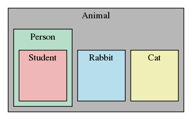

# Объектно-ориентированное программирование
До этого момента мы, в основном, создавали новые действия (глаголы) в Котлине: функции, лямбды, блоки кода и т.п.
Типы данных (существительные) при этом использовались из стандартной библиотеки.
В этой лекции будет рассказано, как создавать свои типы данных.

## Объекты
* в Котлине есть разные типы данных: 
```kotlin
1234
3.14159
"Hello"
listOf(1, 5, 7, 11, 13)
mapOf(
    "CA" to "California",
    "MA" to "Massachusetts"
)
```
* каждое значение - объект, а у каждого объекта есть:
  * тип
    * `1234` имеет тип `Int`
    * `"Hello"` имеет тип `String`
  * внутренние данные (примитивные и составные)
  * свойства
  * функции для работы с ним (методы)
## Объектно-ориентированное программирование (ООП)
* объекты - абстрактные данные, которые объединяют в себе:
  * внутреннее представление (приватные свойства)
  * интерфейс взаимодействия с объектом через публичные свойства и методы, которые определяют поведение, но скрывают реализацию
* есть возможность создавать объекты
* объекты, на которые не ссылается ни одна переменная, доступная из `main` функции, уничтожаются сборщиком мусора
## Стандартные объекты
* многие типы объектов вшиты в Котлин или определены в стандартной библиотеке
  * целые числа: `Byte, Short, Int, Long, BigInteger`
  * дробные числа с плавающей запятой: `Float, Double, BigDecimal`
  * символы `Char`
  * строки `String`
  * перечислимые (`Iterable`, `Collection`, `Set`, `List`), последовательности `Sequence`
  * "бросаемые", исключения и ошибки (`Throwable`, `Error`, `Exception` и их наследники)
  * родитель всех объектов `Any`
* программисту хотелось бы иметь возможность определять собственные типы объектов
## Создание и использование собственных объектов с помощью классов
* обозначим разницу между созданием класса и его использованием
* создание класса подразумевает
  * именование класса
  * декларирование его аттрибутов (свойств, методов)
  * например написание собственной реализации класса `List`
* использование класса подразумевает
  * создание новых объектов - экземпляров класса
  * выполнение операций над ними
  * например
```kotlin
val l = listOf(1, 2)
l.size
```
## Преимущества ООП
* объединение данных и операций над ними
* разработка по принципу: "разделяй и властвуй"
  * можно реализовывать и тестировать поведение каждого класса отдельно
  * позволяет писать модульный код, снижать сложность кода
* классы облегчают повторное использование кода
  * большинство библиотек, наряду с функциями, объявляют новые классы
  * у каждого класса свой контекст, поэтому нет коллизий в именовании функций
  * наследование позволяет наследникам уточнять и расширять поведение родительского класса
## Объявление класса
```kotlin
class Coordinate(val x: Double, val y: Double) : Any() { // аттрибуты класса объявляются здесь
}
```
Здесь
* `class` - ключевое слово, говорящее, что мы объявляем класс
* `Coordinate` - имя класса
* `val x: Int, val y: Int` - аттрибуты (свойства), объявленные в конструкторе класса
* ` : Any()` - родительский класс (в случае, если это `Any`, то можно не писать)
* `fun distance ...` - аттрибут (метод), объявленный в теле класса
## Что такое аттрибуты класса?
* свойства и методы, принадлежащие классу
  * свойства (аттрибуты - данные)
    * другие объекты, из которых состоит класс
    * например координата состоит из двух целых чисел
  * методы (аттрибуты - функции)
    * методы - функции, которые работают с объектами данного класса
    * например можно объявить функцию расстояния между двумя координатами, но она имеет смысл только для координат
## Объявление способа создания объектов класса (конструкторы)
* чтобы создавать объекты класса надо объявить конструктор
```kotlin
class Coordinate(val x: Double, val y: Double) : Any() { // аттрибуты класса объявляются здесь
    constructor(x: Int, y: Int) : this(x.toDouble(), y.toDouble())
}
```
* в классе `Coordinate` объявлен основной конструктор, который инициализирует свойства `x` и `y`
* также в классе объявлен вторичный конструктор `constructor(x: Int, y: Int): this(x.toDouble(), y.toDouble())`, который вызывает основной (`: this(x.toDouble(), y.toDouble())`)
* для основного конструктора слово `constructor` можно не писать
## Создание объекта класса
```kotlin
fun main() {
    // создаёт новый объект класса Coordinate, передавая во вторичный конструктор аргументы 3 и 4
    val c = Coordinate(3, 4)
    val origin = Coordinate(0, 0)
    println(c.x) // аттрибуты объекта c доступны через точку
    println(origin.x)
}
```
* аттрибуты - данные объекта называются свойствами объекта 
* `c` указывает на контекст объекта
  * в рамках этого контекста мы присваиваем значения свойствам
  * `c.x` читается как "получить значение контекста `c` и найти в нём значение, присвоенное свойству `x`", то есть значение `x` данного конкретного объекта
## Что такое метод?
* функция, которая работает с объектами данного класса
* точка используется для доступа к любым аттрибутам объекта
  * свойствам объекта
  * методам объекта
  * для доступа к свойствам объекта изнутри его можно использовать ключевое слово `this`, оно означает ссылку на себя
## Объявление метода
```kotlin
class Coordinate(val x: Double, val y: Double) : Any() { // аттрибуты класса объявляются здесь
    // this ссылается на сам объект, other на другой объект
    fun distance(other: Coordinate): Double =
        sqrt((other.x - this.x).pow(2) + (other.y - this.y).pow(2))
}
```
## Как вызывать метод
```kotlin
fun main() {
    val c = Coordinate(3, 4)
    val origin = Coordinate(0, 0)
    // с - объект, для которого вызывается метод (приёмник или receiver)
    // distance - имя метода
    // origin - параметр метода
    println(c.distance(origin))
}
```
## Строковое представление объекта
```kotlin
fun main() {
    val c = Coordinate(3, 4)
    println(c)
}
```
Выведет `course.lecture9.Coordinate@8efb846`
* представление по умолчанию не информативно
* чтобы его поменять, надо переопределить метод `toString`
* при выполнении `println` Котлин вызывает для переданного объекта `toString` и печатает результат
* при этом программист сам определяет, как будет выглядеть строковое представление объекта, например можно сделать, чтобы координаты выводились в треугольных скобках
## Переопределение строкового представления
```kotlin
class Coordinate(val x: Double, val y: Double) : Any() { // аттрибуты класса объявляются здесь
    override fun toString(): String = "<$x, $y>"
}

fun main() {
    val c = Coordinate(3, 4)
    println(c)
}
```
Пример выше выведет `<3.0, 4.0>`
## Получение информации о типе объекта
* можно запросить информацию о типе объекта: код ниже выведет `class course.lecture9.Coordinate`
```kotlin
fun main() {
    val c = Coordinate(3, 4)
    println(c::class)
}
```
* можно использовать ключевое слово `is`, чтобы проверить, является ли объект объектом класса: код ниже выведет `true`
```kotlin
fun main() {
    val c = Coordinate(3, 4)
    println(c is Coordinate)
}
```
## Перегрузка операторов
* можно определить свое поведение для операторов `+`, `-`, `*`, `/` и других. Детально [тут](https://kotlinlang.ru/docs/reference/operator-overloading.html)
* операторы переопределяются следующим образом:
  * `operator fun plus(other: Coordinate)` -> `c + other`
  * `operator fun minus(other: Coordinate)` -> `c - other`
  * `operator fun times(other: Coordinate)` -> `c * other`
  * `operator fun div(other: Coordinate)` -> `c / other`
  * и другие, подробнее [тут](https://kotlinlang.ru/docs/reference/operator-overloading.html)
## Пример: натуральные дроби
* надо создать новый класс, определяющий натуральные дроби
* свойства класса - два целых числа:
  * numerator - числитель
  * denominator - знаменатель
* методы класса:
  * строковое представление
  * сложить, вычесть
  * преобразовать в `Double`
## Начальное объявление:
```kotlin
class Fraction(val numerator: Int, val denominator: Int) {
    override fun toString(): String = "$numerator / $denominator"
}

fun main() {
    val oneHalf = Fraction(1, 2)
    val twoThirds = Fraction(2, 3)
    println(oneHalf)
    println(twoThirds)
}
```
Выведет
```
1 / 2
2 / 3
```
## Добавляем операторы
```kotlin
class Fraction(val numerator: Int, val denominator: Int) {
    override fun toString(): String = "$numerator / $denominator"
    operator fun plus(other: Fraction): Fraction =
        Fraction(numerator * other.denominator + other.numerator * denominator, denominator * other.denominator)

    operator fun minus(other: Fraction): Fraction =
        Fraction(numerator * other.denominator - other.numerator * denominator, denominator * other.denominator)
}

fun main() {
    val oneHalf = Fraction(1, 2)
    val twoThirds = Fraction(2, 3)
    println(oneHalf + twoThirds)
    println(twoThirds - oneHalf)
}
```
Выведет
```
7 / 6
1 / 6
```
## Добавляем конвертацию в `Double`
```kotlin
class Fraction(val numerator: Int, val denominator: Int) {
    override fun toString(): String = "$numerator / $denominator"
    operator fun plus(other: Fraction): Fraction =
        Fraction(numerator * other.denominator + other.numerator * denominator, denominator * other.denominator)

    operator fun minus(other: Fraction): Fraction =
        Fraction(numerator * other.denominator - other.numerator * denominator, denominator * other.denominator)

    fun toDouble(): Double = numerator / denominator.toDouble()
}

fun main() {
    val oneHalf = Fraction(1, 2)
    val twoThirds = Fraction(2, 3)
    println((oneHalf + twoThirds).toDouble())
}
```
Выведет
```
1.1666666666666667
```
## Пример: множество целых чисел
* создать новый класс, представляющий изменяемую коллекцию целых чисел
  * изначально пустая
  * все числа в множестве уникальны, уникальность гарантируется кодом
* внутреннее представление
  * использовать список для хранения элементов
* интерфейс
  * `fun insert(e: Int): Unit` - добавляет `e` в множество, если его там нет
  * `operator fun contains(e: Int): Boolean` - возвращает `true`, если `e` принадлежит множеству, иначе `false`
  * `fun remove(e: Int): Unit` - удаляет `e` из множества, бросает исключение, если элемента нет
```kotlin
class IntSet {
    private val vals = mutableListOf<Int>()

    fun insert(e: Int) {
        if (e !in vals) vals += e
    }

    operator fun contains(e: Int): Boolean = e in vals

    fun remove(e: Int) {
        if (!vals.remove(e)) throw NoSuchElementException("$e not found")
    }

    override fun toString(): String = vals.sorted().joinToString(prefix = "{", postfix = "}")
}
```
## Использование множества
```kotlin
fun main() {
    val s = IntSet()
    println(s)

    with(s) {
        insert(3)
        insert(4)
        insert(3)
    }
    println(s)

    println(3 in s)
    println(6 in s)

    with(s) {
        remove(3)
        insert(6)
    }
    println(s)

    s.remove(3)
}
```
Выведет
```
{}
{3, 4}
true
false
{4, 6}
Exception in thread "main" java.util.NoSuchElementException: 3 not found
	at course.lecture9.IntSet.remove(IntSet.kt:13)
	at course.lecture9.IntSetKt.main(IntSet.kt:39)
	at course.lecture9.IntSetKt.main(IntSet.kt)
```
## Преимущества ООП
* объединяет вместе объекты, у которых общие
  * аттрибуты
  * функции, работающие с этими аттрибутами
* с помощью абстракции разделяет реализацию класса и использование объектов класса
  * на этапе реализации мы абстрагируемся от того, как объект будет использоваться, и сосредотачиваемся на корректной реализации его поведения
  * на этапе использования мы абстрагируемся от реализации, она нам не важна
* появляется возможность создавать слои абстракции, которые наследуют поведение от родительского класса
* можно создавать свои классы на основе уже существующих
## Реализация класса в сравнении с использованием
* написание кода с двух разных точек зрения
* все примеры, которые были рассмотрены до этого числовые, но ООП не ограничивается числами

Реализация класса|Использование класса
---|---
<ul><li>объявление класса</li><li>объявление свойств</li><li>объявление методов</li></ul>|<ul><li>создание объектов класса</li><li>выполнение операций над ними</li></ul>
## Класс в сравнении с объектом класса
Класс|Использование класса
---|---
<ul><li>класс - это тип<ul><li>тип `Coordinate`</li><li>`class Coordinate`</li></ul></li><li>класс - шаблон для создания объектов</li><li>определяет аттрибуты, общие для всех объектов класса</li></ul>|<ul><li>экземпляр - это один конкретный объект<ul><li>`val c = Coordinate(3, 4)`</li></ul></li><li>разные экземпляры содержат разные значения данных<ul><li>`val c1 = Coordinate(1, 2)`</li><li>`val c2 = Coordinate(3, 4)`</li><li>в `c1` и `c2` хранятся разные значения данных, так как это разные объекты</li></ul></li><li>каждый экземпляр обладает структурой, описанной в классе</li></ul>
## Зачем использовать ООП и классы?
* моделирование реальных объектов
* объединение разных объектов в рамках одного класса

`class Cat`|`class Rabbit`
---|---
<div>Васька, 1 год, рыжий</div><div>Барсик, 2 года, тигровый</div><div>Мурка, 0 лет, трехцветная</div>|<div>5 лет, коричневый</div><div>2 года, белый</div><div>1 год, чёрно-белый</div>
## У групп объектов есть общие аттрибуты
* свойства
  * как объект представлен в виде данных
    * для `Coordinate`: `x` и `y`
    * для животного: цвет и возраст
* методы
  * что может делать объект или какие операции можно с ним проводить
    * для `Coordinate`: `distance`
    * для животного: издать звук, перемещаться
## Геттеры и сеттеры
```kotlin
class Book(name: String) {
    var name = name
        get() = field
        set(value) {
            field = value
        }
}
```
На самом деле, свойство класса в Kotlin - это комбинация из 3 частей:
1. Поле `field` - ссылка на область памяти, где хранится значение свойства. Может отсутствовать у делегированных свойств (пример ниже)
1. Геттер `get()` - метод для получения значения свойства. Если не объявлен явно, то Kotlin генерирует `get() = field`
1. Сеттер `set(value)` - метод для изменения значения свойства. Существует только для `var` свойств. 
Если не объявлен явно, то Kotlin генерирует `set(value) { field = value }`
За счёт этого появляется возможность разделить интерфейс объекта и его реализацию.
Например, мы хотим переименовать свойство `name` в `title`, но при этом хотим сделать так, чтобы его значение было доступно и по старому именованию `name`

Было:
```kotlin
class Book(var name: String)
```
Стало:
```kotlin
class Book(var title: String) {
    var name
        get() = title
        set(value) {
            title = value
        }
}
```
В этом случае `name` - делегированное свойство (оно делегирует хранение значения свойству `title`).
У делегированного свойства есть только геттер и сеттер, но нет поля
## Сокрытие реализации
* при объявлении класса полезно разделять аттрибуты, предназначенные для взаимодействия с объектами класса извне (интерфейс), и аттрибуты, предназначенные для реализации поведения класса
* если внутренние детали реализации будут общедоступны, то это приведёт к проблемам:
  * менять реализацию будет очень тяжело, так как это сломает код, зависящий от предыдущей версии
  * крайне сложно гарантировать поведение объекта, если любое его свойство может быть изменено извне
* выход - сокрытие реализации
Для сокрытия реализации в Kotlin используются [модификаторы доступа](https://kotlinlang.ru/docs/reference/visibility-modifiers.html). Их 4:
* `pulbic` - аттрибут с этим модификатором доступен из любой части кода. Это модификатор по умолчанию, то есть `fun foo` и `pulbic fun foo` означают одно и то же
* `internal` - аттрибут с этим модификатором доступен в пределах [модуля](https://kotlinlang.ru/docs/reference/visibility-modifiers.html#modules)
* `protected` - аттрибут с этим модификатором доступен в классе и его наследниках. Недоступно для объявлений уровня файла
* `private` - аттрибут с этим модификатором доступен в классе и его вложенных классах/объектах. Для объявлений уровня файла обозначает, что оно доступно только в этом файле
## Наследование и иерархии
### Иерархии



* родительский класс (надкласс, superclass)
* дочерний класс (подкласс, subclass)
  * наследует все данные и поведение родительского класса
  * может добавить данных
  * может добавить поведение
  * может переопределить поведение
### Наследование
```kotlin
abstract class Animal(val age: Int, val name: String) {
    abstract fun speak()
    override fun toString(): String = "Animal(age=$age, name=$name)"
}

class Cat(age: Int, name: String) : Animal(age, name) {
    override fun speak(): Unit = meow()
    override fun toString(): String = "Cat(age=$age, name=$name)"
    fun meow(): Unit = println("мяу")
    fun animalToString(): String = super.toString()
}
```
* `abstract class Animal` - класс `Animal` является абстрактным, то есть его поведение не до конца определено, поэтому можно создавать только объекты его потомков, но не его самого
* `abstract fun speak` - метод `speak` является абстрактным (объявлен без тела), то есть он должен определяться каждым потомком 
* `Cat ... : Animal ...` - класс `Cat` является подклассом класса `Animal`
  * наследует все его аттрибуты:`age`, `name`
  * реализует абстрактное поведение: метод `speak`
  * добавляет поведение: метод `meow`
  * добавляет поведение: метод `animalToString`, в котором используется ключевое слово `super` для вызова родительского метода `toString`
  * переопределяет поведение: метод `toString`
### Какой из методов будет вызван (полиморфизм)?
* подкласс может переопределять `abstract`/`open` методы родителя
* подкласс может иметь такой же метод, как и другой подкласс
* для определения, какой метод исполнить при вызове из кода, Котлин смотрит, определён ли такой метод у объекта, если да, то его и исполняет
* если нет - ищет у родительского класса, затем у прародителя и т.д.
* первый найденный таким образом метод и будет исполнен
### Примеры
#### класс `Person` из иерархии [AnimalHierarchy](AnimalHierarchy.kt)
```kotlin
open class Person(age: Int, name: String) : Animal(age, name) {
    private val friends: MutableSet<String> = mutableSetOf()
    override fun speak(): Unit = hello()
    override fun toString(): String = "Person(name=$name, age=$age, friends=$friends)"
    open fun hello(): Unit = println("привет")
    fun getFriends(): List<String> = friends.toList()
    fun addFriend(name: String) {
        friends += name
    }

    fun ageDiff(other: Person): Unit = (age - other.age).let {
        when (it) {
            in Int.MIN_VALUE until 0 -> "$name на ${-it} лет моложе, чем ${other.name}"
            in 1..Int.MAX_VALUE -> "$name на $it лет старше, чем ${other.name}"
            else -> "$name и ${other.name} - ровесники"
        }
    }.let(::println)
}
```
Здесь
* родительский класс `Animal`
* `Animal(age, name)` - вызов родительского конструктора
* `friends` (список друзей) - новое `private` свойство, определённое в классе `Person`
* `getFriends` - новый метод, определённый в классе `Person` для получения копии списка друзей
* `addFriend` - новый метод, определённый в классе `Person` для добавления друга в список
* `ageDiff` - новый метод, определённый в классе `Person` для вывода разницы в возрасте
* `toString` - переопределение метода, определённого в классе `Animal`
* `speak` - реализация абстрактного метода, объявленного в классе `Animal`

[Пример использования](PersonSample.kt)
```kotlin
fun main() {
    val eric = Person("Eric", 45)
    val john = Person("John", 55)
    eric.speak() // выведет "привет"
    eric.ageDiff(john) // выведет "Eric на 10 лет моложе, чем John"
    john.ageDiff(eric) // выведет "John на 10 лет старше, чем Eric"
}
```
#### класс `Student` из иерархии [AnimalHierarchy](AnimalHierarchy.kt)
```kotlin
class Student(name: String, age: Int, var major: String? = null) : Person(name, age) {
    override fun hello(): Unit = when (Random.nextInt(1..4)) {
        1 -> "мне надо делать домашнее задание"
        2 -> "мне надо спать"
        3 -> "хочу есть"
        else -> "смотрю телевизор"
    }.let(::println)

    override fun toString(): String = "Student(name=$name, age=$age, major=$major)"
}
```
Здесь
* родительский класс `Person`. `Student` наследует все аттрибуты `Person` и `Animal`
* `var major: String? = null` - добавляем новое свойство "курс", по умолчанию не задано (`null`)
* `hello` - переопределение метода, определённого в классе `Person`. Метод обладает случайным поведением (как и поведение большинства студентов)
  * `Random.nextInt(1..4)` - выбирает случайное целое из интервала `1..4`
* `toString` - переопределение метода, определённого в классе `Person`

[Пример использования](StudentSample.kt)
```kotlin
fun main() {
    val fred = Student("Fred", 21, "Course VI")
    println(fred) // выведет "Student(name=Fred, age=21, major=Course VI)"
    repeat(4) { fred.speak() } // выведет 4 случайных сообщения
}
```
## Объекты - компаньоны
* служат для объявления свойств, общих для всего класса, а не принадлежащих отдельному объекту

Свойства экземпляра|Свойства объекта - компаньона
---|---
<ul><li>до этого в лекции встречались только свойства экземпляра</li><li>у каждого экземпляра свои значения свойств</li><li>создаётся для каждого экземпляра</li><li>можно использовать `this` для получения значения</li></ul>|<ul><li>принадлежат всему классу</li><li>определяются внутри объекта - компаньона</li><li>общие для всех экземпляров класса</li></ul>
### Пример: класс `Rabbit` из иерархии [AnimalHierarchy](AnimalHierarchy.kt)
```kotlin
class Rabbit(age: Int, name: String, val parent1: Rabbit? = null, val parent2: Rabbit? = null) : Animal(age, name) {
    val rid: Int = tag++

    override fun speak(): Unit = meep()
    override fun toString(): String = "Rabbit(age=$age, name=$name)"
    fun meep(): Unit = println("meep")

    override fun equals(other: Any?): Boolean = this === other ||
        other is Rabbit && other.javaClass == Rabbit::class.java && (
        parent1?.rid == other.parent1?.rid && parent2?.rid == other.parent2?.rid ||
            parent1?.rid == other.parent2?.rid && parent2?.rid == other.parent1?.rid
        )

    override fun hashCode(): Int = parent1?.rid.hashCode() * 31 + parent2?.rid.hashCode()

    companion object {
        private var tag = 1
    }
}
```
* здесь в объекте - компаньоне определяется свойство `tag`, общее для всех кроликов, которое используется для генерации порядкового номера `rid` при создании кролика
* так же переопределены методы `equals` и `hashCode`, таким образом, что два кролика считаются равными (`==`), если их родители равны
* родители сравниваются по `rid`, так как `rid` кролика уникален

[Пример использования](RabbitSample.kt)
```kotlin
fun main() {
    val peter = Rabbit(2, "Peter")
    val hopsy = Rabbit(3, "Hopsy")
    val cotton = Rabbit(1, "Cottontail", peter, hopsy)
    println(cotton) // выведет "Rabbit(age=1, name=Cottontail)"
    println(cotton.parent1) // выведет "Rabbit(age=2, name=Peter)"
    val mopsy = Rabbit(0, "Mopsy", hopsy, peter)
    println(mopsy == cotton) // выведет true, так как у cotton и mopsy одни и те же родители
}
```
## Резюмируя классы и ООП
* объединяет вместе объекты, которые имеют общие аттрибуты
  * свойства
  * методы
* использует абстракцию, чтобы разделить реализацию класса и его использование
* строит слои абстракции за счёт наследования поведения от родительских классов
* позволяет создавать свои типы на основе уже существующих
## [Интерфейсы](https://kotlinlang.ru/docs/reference/interfaces.html)
* абсолютно абстрактные классы
* могут содержать
  * абстрактные методы (не требует ключевого слова `abstract`, достаточно не определять тело метода)
  * открытые (`open`) методы с определённым телом (не требует ключевого слова `open`, достаточно определить тело метода)
  * абстрактные свойства (не требует ключевого слова `abstract`, достаточно не определять геттер/сеттер)
  * открытые делегированные свойства (не требует ключевого слова `open`, достаточно определить геттер/сеттер)
* не могут содержать
  * закрытые (`final`) методы и свойства
  * инициализированные свойства
* класс может наследовать (реализовывать) несколько интерфейсов, но только один класс
  * за счёт этого объект одного и того же класса может быть использован в разных библиотеках
### [Пример](InterfacesSample.kt)
```kotlin
/** библиотека "Докладчик"*/
/** библиотека "Докладчик"*/
interface Speaker {
    fun say() // абстрактный метод в интерфейсе не требует ключевого слова abstract
    fun speak(): Unit = println(speech) // открытый метод может быть определён в интерфейсе
    val speech: String // абстрактное свойство в интерфейсе не требует ключевого слова abstract
//    val story = "story" // а вот инициализированное свойство - уже нет
}

fun performSpeech(speaker: Speaker) {
    println("А сейчас выступит $speaker с речью ${speaker.speech}")
    speaker.say()
    speaker.speak()
}
/** конец библиотеки "Докладчик"*/

/** библиотека "Охотник"*/
interface Hunter {
    val name: String // абстрактное свойство в интерфейсе не требует ключевого слова abstract
    fun hunt() = println("$name охотится") // открытый метод может быть определён в интерфейсе
    fun speak(): Unit = println(name) // открытый метод может быть определён в интерфейсе
}

fun forestHunt(hunter: Hunter) {
    println("В лесу охотится $hunter по имени ${hunter.name}")
    hunter.hunt()
}
/** конец библиотеки "Охотник"*/

abstract class Animal(val age: Int, val name: String) {
    abstract fun speak()
    override fun toString(): String = "Animal(age=$age, name=$name)"
}

/** класс [Dog] является [Animal], а так же [Speaker] и [Hunter]*/
class Dog(age: Int, name: String) : Animal(age, name), Speaker, Hunter {
    /** определяем абстрактный метод из интерфейса [Speaker] */
    override fun say(): Unit = speak()

    /** определяем абстрактное свойство из интерфейса [Speaker] */
    override val speech: String = "гав"

    /** определяем абстрактный метод из класса [Animal]
     * после super в <> явно указываем, из какого родителя вызывать реализацию,
     * так как он реализован и в [Speaker.speak], и в [Hunter.speak]
     */
    override fun speak() {
        super<Speaker>.speak()
        super<Hunter>.speak()
    }
    /** поле [Hunter.name] определять не нужно, так как мы унаследовали его от [Animal]
     * к тому же его нельзя переопределить, так как оно не open в [Animal]
     */
}

fun main(): Unit = Dog(2, "Шарик").let {
    performSpeech(it)
    forestHunt(it)
}
```
выведет
```text
А сейчас выступит Animal(age=2, name=Шарик) с речью гав
гав
Шарик
гав
Шарик
В лесу охотится Animal(age=2, name=Шарик) по имени Шарик
Шарик охотится
```
## [Расширения (extensions)](https://kotlinlang.ru/docs/reference/extensions.html)
* не дают новых возможностей по отношению к обычным функциям (синтаксический сахар), но позволяют записывать выражения, используя более плавный синтаксис
* бывают функции-расширения и свойства-расширения
### [Пример](ExtensionsSample.kt)
```kotlin
/** преобразование элементов [xs] из [Int] в [Double] */
fun toDoubles(xs: Iterable<Int>): Iterable<Double> = xs.map(Int::toDouble)

/** произведение элементов перечислимого [xs] */
fun product(xs: Iterable<Double>): Double = xs.fold(1.0, Double::times)

/** преобразование элементов [this] из [Int] в [Double], объявленное как функция-расширение */
fun Iterable<Int>.toDoublesExt(): Iterable<Double> = this.map(Int::toDouble)

/** произведение элементов перечислимого [this], объявленное как функция-расширение */
fun Iterable<Double>.productExt(): Double = this.fold(1.0, Double::times)

/** преобразование элементов [this] из [Int] в [Double], объявленное как свойство-расширение */
val Iterable<Int>.toDoublesExt: Iterable<Double> get() = this.map(Int::toDouble)

/** произведение элементов перечислимого [this], объявленное как свойство-расширение */
val Iterable<Double>.productExt: Double get() = this.fold(1.0, Double::times)

fun main() {
    val xs = (1..5)

    /** без расширений у нас получается плохо читаемая конструкция со вложенными скобками и обратным порядком функций,
    * если читать слева направо:
    * читаем product, toDoubles, при этом сначала выполняется toDoubles, а затем product
    */
    val product = product(toDoubles(xs))
    println(product)

    /** с функциями-расширениями из выражения исчезли вложенные скобки и порядок вызовов совпадает с порядком
     * чтения слева направо
     */
    val productExtFun = xs.toDoublesExt().productExt()
    println(productExtFun)

    /** со свойствами-расширениями из выражения исчезли вложенные скобки и порядок вызовов совпадает с порядком
     * чтения слева направо
     */
    val productExtVal = xs.toDoublesExt.productExt
    println(productExtVal)
}
```
## Объявление расширений в качестве членов класса (контекстно-зависимые операции)
* позволяют определить операции над объектами, доступные только в контексте некоторого другого объекта
### [Пример - контекст обменника валют](MemberExtensionSample.kt)
* пусть у нас есть объекты следующих классов:
  * `Currency` - валюта
  * `Asset` - актив в валюте
  * `CurrencyConverter` - обменник валют, отвечает за хранение курсов валют и операции с ними
* мы хотим, чтобы у нас были следующие операции:
  * `/` определённая для двух валют, результат - курс одной валюты к другой
  * `*` определённая для числа и валюты, результат - актив в валюте, равный числу
  * `convertTo` определённая для актива и валюты, результат - актив, сконвертированный в валюту по курсу
* эти операции должны быть доступны только в контексте обменника валют, так как вне этого контекста неизвестны курсы валют
```kotlin
class Asset(val currency: Currency, val whole: Int, val cents: Int = 0) {
    init {
        require(whole * cents >= 0) { "Целая($whole) и дробная($cents) части валюты имеют разные знаки" }
        require(cents in -99..99) { "Дробная($cents) часть валюты за пределами интервала -99..99" }
    }

    override fun toString(): String = "${
        "-".takeIf { min(whole.sign, cents.sign) < 0 } ?: ""
    }${abs(whole)}.${abs(cents) / 10}${abs(cents) % 10} $currency"
}

val USD: Currency = Currency.getInstance("USD")
val RUB: Currency = Currency.getInstance("RUB")
val EUR: Currency = Currency.getInstance("EUR")

class CurrencyConverter {
    private val rates = mutableMapOf<Currency, Double>().also {
        it[USD] = 1.0
    }

    operator fun set(dividend: Currency, divisor: Currency, rate: Double) {
        check(rate > 0) { "Попытка присвоить курсу $dividend/$divisor не положительное значение $rate" }
        check(dividend != divisor) { "Попытка задать курс валюты $dividend по отношению к себе" }
        val divisorRate = rates[divisor]
        val dividendRate = rates[dividend]
        when {
            dividend == USD -> rates[divisor] = 1 / rate
            divisor == USD -> rates[dividend] = rate
            divisorRate != null -> rates[dividend] = rate * divisorRate
            dividendRate != null -> rates[divisor] = dividendRate / rate
            else -> error("Попытка присвоить значение курсу $dividend/$divisor при неизвестных курсах $dividend и $divisor")
        }
    }

    operator fun Currency.div(divisor: Currency): Double = rates[this]!! / rates[divisor]!!

    operator fun Double.times(currency: Currency): Asset =
        Asset(currency.also { rates[it]!! }, toInt(), (this * 100).toInt() % 100)

    operator fun Int.times(currency: Currency): Asset = toDouble() * currency

    infix fun Asset.convertTo(toCurrency: Currency): Asset =
        ((whole * 100 + cents) * (currency / toCurrency) / 100).times(toCurrency)
}

fun main(): Unit = CurrencyConverter().run {
    this[USD, RUB] = 77.03
    this[EUR, RUB] = 90.72
    println("Курс доллара к рублю: ${USD / RUB}")
    println("Курс евро к рублю: ${EUR / RUB}")
    println("Курс евро к доллару: ${EUR / USD}")
    val oneEUR = 1 * EUR
    println("$oneEUR = ${oneEUR convertTo RUB} = ${oneEUR convertTo USD}")
}
```

## [Классы данных](https://kotlinlang.ru/docs/reference/data-classes.html) / [Data Classes](https://kotlinlang.org/docs/reference/data-classes.html)

* основное назначение — хранение данных
* пример: `data class User(val name: String, val age: Int)`
* генерируемые методы:
    * `equals()`/`hashCode()`, определяющие равенство двух объектов класса на основании равенства его свойств
    * функция `toString()` в форме `"User(name=John, age=42)"`
    * компонентные функции [`componentN()`](https://kotlinlang.ru/docs/reference/multi-declarations.html), которые
      соответствуют свойствам, в соответствии с порядком их объявления
    * функция копирования `copy()` (см. ниже)
* требования к классам данных:
    * основной конструктор должен иметь минимум один параметр
    * все параметры основного конструктора должны быть свойствами (`val` или `var`)
    * не может быть `abstract`, `open`, `sealed`, `enum` или `inner`
* дополнительные правила для генерации методов, связанные с наследованием:
    * если `equals()`, `hashCode()`, `toString()` явно объявлены в теле класса или помечены как `final` в родительском
      классе, то они не генерируются
    * если в родительском классе объявлены `componentN()` с модификатором `open`, и возвращающие совместимые типы, то
      они переопределяются сгенерированными. Иначе ошибка компиляции.
    * наследование от типа, в котором объявлена функция `copy()`, с совпадающей сигнатурой, запрещено
    * явное объявление `componentN()` и `copy()` в теле класса запрещено
    * свойства, объявленные в теле класса, не используются при генерации методов
  ```kotlin
    val human1 = Human("Андрей")
    val human2 = Human("Андрей")
    human1.age = 10
    human2.age = 20
    println(human1)                     // выведет "Human(name=Андрей)"
    println(human1 == human2)           // выведет "true"
  ```

### Функция копирования `copy()`

Используется, когда надо скопировать объект с изменением только некоторых свойств:

```kotlin
    val andrey = User(name = "Андрей", age = 1)
val olderAndrey = andrey.copy(age = 2)
println(andrey)                     // выведет "User(name=Андрей, age=1)"
println(olderAndrey)                // выведет "User(name=Андрей, age=2)"
```

### Классы данных и [мульти-декларации](https://kotlinlang.ru/docs/reference/data-classes.html)

Сгенерированные компонентные функции [`componentN()`](https://kotlinlang.ru/docs/reference/multi-declarations.html)
позволяют деструктуризировать классы данных в мульти-декларациях:

```kotlin
    val ivan = User("Иван", 30)
val (name, age) = ivan              // мульти-декларация
println("$name, возраст $age лет")  // выведет "Иван, возраст 30 лет"
```

### [Примеры](DataClassesSample.kt)